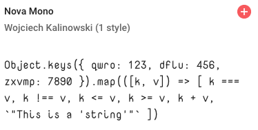

# My Favorite Fonts

_This repo is a collection of my favorite open source fonts._ It exists as a convenience for myself. 

All fonts obtained from [Google Fonts](https://fonts.google.com/) with exceptions:
  - `Inconsolata` was obtained from https://github.com/googlefonts/Inconsolata
  - `Ligconsolata` was obtained from https://github.com/googlefonts/Inconsolata

In each example I used the following test string:

```js
Object.keys({ 
  qwro: 123, 
  dflu:  456, 
  zxvmp:  7890 
}).map(([k, v]) => [
  k === v,
  k !== v,
  k <= v,
  k >= v,
  k + v,
  `"This is a 'string'"`
])
```

Here are the screenshots of the samples in order of my favorite:


This is my favorite because it looks a lot like [Monaco](https://en.wikipedia.org/wiki/Monaco_(typeface)), which is my favorite non open source font on Mac OSX.

<br/>


This font looks professional and easy to read.

<br/>


Similar to Source Code Pro, this font is clean and easy to read, but x-height is a little taller, which makes it easier to read on super small font sizes (like a terminal).

<br/>



The only reason I like this one is that it looks _spacey_. I have not found a practical use for it.

<br/>

It was not until I pulled down the source code for `Inconsolata` that I discovered `Ligconsolata`, which is `Inconsolata` with Ligatures!


## VS Code integration

You need to enable font ligatures in VS Code to get some fonts to work right. I also tend to have to mess with the line height and letter spacing in settings.

```json
{
  "editor.fontFamily": "Ligconsolata, Consolas, 'Courier New', monospace",
  "editor.fontLigatures": true,
  "editor.fontSize": 16,
  "editor.lineHeight": 20,
  "editor.letterSpacing": 0.3,
}
```